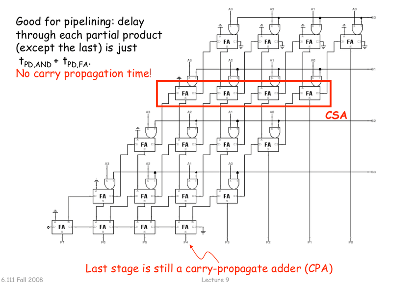

# Content

## Learning Outcome

In this chapter:

- You will learn how to use ROHD pipeline abstraction API to build carry save multiplier.

## ROHD Pipelines

ROHD has a built-in syntax for handling pipelines in a simple & refractable way. The example below shows a three-stage pipeline which adds 1 three times. Note that `Pipeline` consumes a clock and a list of stages, which are each a `List<Conditional> Function(PipelineStageInfo p)`, where `PipelineStageInfo` has information on the value of a given signal in that stage. The `List<Conditional>` the same type of procedural code that can be placed in `Combinational`.

```dart
Logic a;
var pipeline = Pipeline(clk,
  stages: [
    (p) => [
      // the first time `get` is called, `a` is automatically pipelined
      p.get(a) < p.get(a) + 1
    ],
    (p) => [
      p.get(a) < p.get(a) + 1
    ],
    (p) => [
      p.get(a) < p.get(a) + 1
    ],
  ]
);
var b = pipeline.get(a); // the output of the pipeline
```

This pipeline is very easy to refractor. If we wanted to merge the last two stages, we could simple rewrite it as:

```dart
Logic a;
var pipeline = Pipeline(clk,
  stages: [
    (p) => [
      p.get(a) < p.get(a) + 1
    ],
    (p) => [
      p.get(a) < p.get(a) + 1,
      p.get(a) < p.get(a) + 1
    ],
  ]
);
var b = pipeline.get(a);
```

You can also optionally add stalls and reset values for signals in the pipeline. Any signal not accessed via the `PipelineStageInfo` object is just accessed as normal, so other logic can optionally sit outside of the pipeline object.

ROHD also includes a version of `Pipeline` that support a ready/valid protocol called `ReadyValidPipeline`. The syntax looks the same, but has some additional parameters for readys and valids.

## Carry Save Multiplier (4 x 4)

Carry Save Multiplier is a digital circuit used for multiplying two binary numbers. It is a specialized multiplication technique that is commonly employed in high-performance arithmetic units, particularly in digial signal processing (DSP) applications.

The carry-save multiplier approach aims to enhance the speed and efficiency of the multiplication operation by breaking it down into smaller parallel operations. Instead of directly multiplying the netire multiplicand and mulltiplier, the carry-save multiplier splits them into smaller components and performs independent multiplications on each components.

We can build carry save multiplier using carry save adder we build last time. The diagram below shows the architectures of the carry save multiplier built using carry save adder.



### Pipeline Stage

Assume that we have input **A = 1100** and **B = 0010**. The final results or the last stage would be **11000**.

The **first stage** of the carry save multiplier consists of Full Adder that takes in AND gate of Ax and B0 where x is the bit position of the inputs a.

In the stage 1, the full adder takes in:
Inputs
A: 0
B: AND(Ax, B0)
C-In: 0

In the stage 2 to 4, the full adder takes:
Inputs
A: Output sum from previous stage
B: AND(Ax, By), where x is the single bit of the A, while y is the bits based on stage.
C-In: Output carry-out from previous stage

Notice the diagram, the first index of the FA always takes in 0 as input A.
First FA
A: 0

The last stage is still carry propagate adder.
