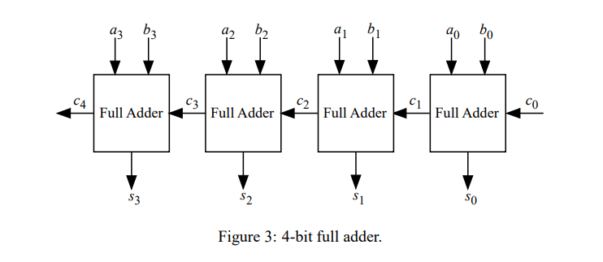

# Basic Generation

In this module, we are going to explore on how to use object-oriented programming(OOP) to generate hardware. We are going to create N-bits full adder by using function and class.

In ROHD, dart conditionals and flow allow us to have the flexibility of generating hardware.

In this example, we are going to see how we can use `for loop` in dart to generate an `n-bit fulladder`.

## Step 1: Create a unit test

Let get started by creating a `main()` function that received two-inputs `Logic a, and Logic b`.

An output name `sum` can be also created. Remember that `sum` is the final value that are generated from our `nBitAdder` function. Therefore, its can be expressed with ` final sum = nBitAdder(a, b)`. This would mean the variable sum is the return output from nBitAdder function. 

Notice that there are red lines on your code that indicates missing of function `nBitAdder`. Hence, you need to just create a function `nBitAdder` that temporary return any `Logic`. In this case, we can just make it return `Const(1)`.

Next, we are going to create the test that state should return 10 when both A and B equal to 5 which also mean 5 + 5 = 10. It's just a simple arithmetic.

```dart
Logic nBitAdder(Logic a, Logic b) {
  return Const(1);
}

void main() {
  final a = Logic(name: 'a', width: 8);
  final b = Logic(name: 'b', width: 8);

  final sum = nBitAdder(a, b);

  test('should return 10 when both A, B equal to 5.', () async {
    a.put(5);
    b.put(5);

    expect(sum.value.toInt(), equals(10));
  });
}
```

Well, as expected your test would fail and stating expected value 10 but getting value 1 instead. Don't worry, remember the red hat? Yes, this is where we are and we will fix it in next few step.

## Step 2: ROHD Module & Classes

Hmm, so the concept of full adder is there are three inputs `a`, `b`, `carry-in` and will return `sum` and `carry-out` bit. 

In n-bit full adder, the diagram below pretty explain everythings. Well, the explaination is:

> A ripple carry adder is a digital circuit that produces the arithmetic sum of two binary numbers. It can be constructed with full adders connected in cascaded (see section 2.1), with the carry output from each full adder connected to the carry input of the next full adder in the chain. Figure 3 shows the interconnection of four full adder (FA) circuitsto provide a 4-bit ripple carry adder. Notice from Figure 3 that the input is from the right side because the first cell traditionally represents the least significant bit (LSB). Bits a0 and b0 in the figure represent the least significant bits of the numbers to be added. The sum output is represented by the bits s0-s3.



[(source)]("https://www.ece.uvic.ca/~fayez/courses/ceng465/lab_465/project1/adders.pdf")

Let back to our code, we now want to complete the function. Do you notice that pattern in the diagram? Yes, it's a repetition of Single Full-Adder from our previous tutorial! 

Let get started with creating a FullAdder Module. Just like any programming, we can create a `fullAdder` function that take in `Logic a`, `Logic b` and `Logic carryIn`. We can also create a class that purpose is to hold the value of the Full-Adder results. We can name this class as `FullAdderResult`. This class is going to have properties `sum` and `cOut` without any method.

Inside the `fullAdder` function, let declare the fulladder logic and assign to the `FullAdderResult` object's properties.

```dart
// Result class of full adder
class FullAdderResult {
  final sum = Logic(name: 'sum');
  final cOut = Logic(name: 'c_out');
}

// fullAdder function that has a return type of FullAdderResult
FullAdderResult fullAdder(Logic a, Logic b, Logic carryIn) {
  final and1 = carryIn & (a ^ b);
  final and2 = b & a;

  final res = FullAdderResult();
  res.sum <= (a ^ b) ^ carryIn;
  res.cOut <= and1 | and2;

  return res;
}
```

## Step 3: Iterations
So now we removed the `Const(1)`, we don't need this anymore as we will be filling up the function with concreate implementation. 

Let start by making sure the width in `a` and `b` is the same by using `assert`. Next, we can create a `carry` variable that contains `Const(0)` and also create a `List` that hold `Logic` signals `sum` and final output of `carry`.

We can create a for loop to iterate over all the bits in the widths by instatiating the `FullAdder` object and passed in value of `a[i]`, `b[i]` and `carry` to the constructor. 

Since `FullAdder` will return `FullAdderResult`, we can access the properties of `carry` by `res.cOut` and replace the value of previous carry. The result of the `res.sum` will be append to the list `sum`. The iteration will loop through all the bits and add the final `carry` value to the `sum` list. 

The we will use `rswizzle()` on `sum` to perform a concatenation operation on the list of signals, where index 0 of this list is the least significant bit(s).

```dart
// Example of rswaizzle
valueOne = '010100000';
valueOne.rswizzle();

print(valueOne.value.toString(includeWidth: false));
// Output: 000001010
```

```dart
Logic nBitAdder(Logic a, Logic b) {
  assert(a.width == b.width, 'a and b should have same width.');

  final n = a.width;
  Logic carry = Const(0);
  final sum = <Logic>[];

  for (var i = 0; i < n; i++) {
    final res = fullAdder(a[i], b[i], carry);
    carry = res.cOut;
    sum.add(res.sum);
  }

  sum.add(carry);

  return sum.rswizzle();
}
```

## Step 4: Rerun the test

Now let, run the test and voila! Everything is green and working now!!